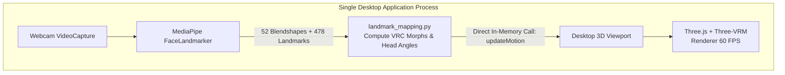

# Design Specification: Desktop VTuber 3D Avatar & Facial Mapping

**Date**: 2026-10-07  
**Status**: Approved by User  
**Target Architecture**: Native Desktop Application with In-Memory IPC (No WebSockets / No Network Ports)

---

## 1. Overview & Goals

This project provides real-time facial expression and head movement tracking mapped directly to a 3D VRM model (`assets/character.vrm`), displayed inside a dedicated desktop application window.

### Key Objectives
1. **Camera Facial Landmark & Blendshape Tracking**: Using MediaPipe FaceLandmarker in video mode, capturing 478 landmarks and 52 ARKit blendshapes.
2. **Accurate Morph Target Mapping**: Mapping ARKit blendshapes directly to the 16 VRChat morph targets actually embedded in `character.vrm` (`Mesh_InteriorMouth2`):
   - Eye blink (`vrc_blink`)
   - Japanese viseme mouth shapes (`vrc_v_aa`, `vrc_v_oh`, `vrc_v_ou`, `vrc_v_ee`, `vrc_v_ih`)
   - Rest / silence (`vrc_v_sil`)
3. **3D Head Pose Computation**: Calculating 3D head rotation (Pitch, Yaw, Roll) via facial geometry (`cv2.solvePnP` or key landmark vectors) to drive `mixamorig:Head` and `mixamorig:Neck` bones.
4. **Desktop Native Window**: Rendered inside a desktop application window (PyQt6 / WebEngine or embedded desktop renderer) running 60 FPS Three.js + `@pixiv/three-vrm` with hardware acceleration.
5. **Zero WebSockets / Zero Network Ports**: Direct in-memory IPC or local memory calling (`runJavaScript` / direct process pipe) to update motion state without opening any network ports.
6. **Smooth Motion (LERP)**: Linear interpolation to remove camera jitter and ensure fluid avatar movement.

---

## 2. System Architecture



### Component Details:
1. `src/face_detector.py`: Existing detector, extracts 52 ARKit blendshapes and 478 landmarks from webcam frames.
2. `src/landmark_mapping.py`:
   - Computes 16 VRC morph targets: `vrc_blink`, `vrc_v_aa`, `vrc_v_oh`, `vrc_v_ou`, `vrc_v_ee`, `vrc_v_ih`, `vrc_v_sil`.
   - Computes Euler head rotation: Pitch, Yaw, Roll (bounded to natural human range: pitch [-0.5, 0.5], yaw [-0.7, 0.7], roll [-0.4, 0.4] rad).
3. `viewer/`:
   - `index.html`: Desktop UI layout.
   - `style.css`: Clean, dark studio styling.
   - `libs/three.min.js` & `libs/three-vrm.min.js`: Local Three.js and VRM loader libraries (100% offline).
   - `app.js`: 3D scene setup, VRM loading, LERP smoothing loop, and global `window.updateMotion(data)` callback.
4. `src/vrm_renderer.py`:
   - Encapsulates Desktop Window lifecycle (`QMainWindow` + `QWebEngineView`).
   - Starts camera worker thread.
   - Forwards each motion packet directly into the JS runtime via `runJavaScript`.
5. `src/main.py`:
   - Entry point: Initializes and runs the desktop application.
   - Clean shutdown handler on window close or `Ctrl+C` / `Esc`.

---

## 3. Data Specification

Each frame produces a JSON motion packet:
```json
{
  "vrc": {
    "vrc_blink": 0.0,
    "vrc_v_aa": 0.0,
    "vrc_v_oh": 0.0,
    "vrc_v_ou": 0.0,
    "vrc_v_ee": 0.0,
    "vrc_v_ih": 0.0,
    "vrc_v_sil": 1.0
  },
  "rotation": {
    "pitch": 0.0,
    "yaw": 0.0,
    "roll": 0.0
  }
}
```

### Morph Target Weight Formulas:
- `vrc_blink`: `clamp((eyeBlinkLeft + eyeBlinkRight) * 0.5 * 1.2, 0.0, 1.0)`
- `vrc_v_aa`: `clamp(jawOpen * 1.2 + mouthLowerDownLeft * 0.3 + mouthLowerDownRight * 0.3 - mouthClose * 0.5, 0.0, 1.0)`
- `vrc_v_ee`: `clamp((mouthStretchLeft + mouthStretchRight) * 0.5 + (mouthSmileLeft + mouthSmileRight) * 0.4, 0.0, 1.0)`
- `vrc_v_ih`: `clamp((mouthPressLeft + mouthPressRight) * 0.5 + (mouthSmileLeft + mouthSmileRight) * 0.3, 0.0, 1.0)`
- `vrc_v_oh`: `clamp(jawOpen * 0.6 + mouthPucker * 0.7 + mouthFunnel * 0.3, 0.0, 1.0)`
- `vrc_v_ou`: `clamp(mouthPucker * 1.1 + mouthFunnel * 0.7, 0.0, 1.0)`
- `vrc_v_sil`: `clamp(1.0 - (vrc_v_aa + vrc_v_ee + vrc_v_oh + vrc_v_ou + vrc_v_ih), 0.0, 1.0)`

### Bone Distribution:
- Neck (`mixamorig:Neck`): `30%` of rotation (`pitch * 0.3`, `yaw * 0.3`, `roll * 0.3`)
- Head (`mixamorig:Head`): `70%` of rotation (`pitch * 0.7`, `yaw * 0.7`, `roll * 0.7`)

---

## 4. Error Handling & Edge Cases
- **No Face Detected**: Decay blendshapes towards neutral (`vrc_v_sil = 1.0`), decay rotation towards `(0, 0, 0)`.
- **Camera Failure**: Print clear diagnostic error if `/dev/video0` cannot be opened.
- **Model Loading**: Check `assets/character.vrm` exists and provide visual loading status before displaying scene.
- **Offline Reliability**: All JS dependencies bundled locally under `viewer/libs/`.

---

## 5. Verification Plan
1. **Unit Test**: Test `src/landmark_mapping.py` with mock ARKit blendshapes and verify correct output ranges [0, 1] and head rotation values.
2. **Model Integrity Test**: Verify `assets/character.vrm` target names match the mapping dictionary.
3. **End-to-End Execution**: Launch `python src/main.py`, confirm desktop window opens, camera feed drives avatar, and window closes cleanly without dangling threads.
